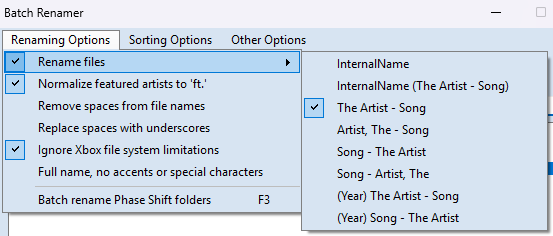

# BackBeat

Batch-download and post-process YouTube music videos for use as **in-game backgrounds in rhythm games** (e.g. YARG).

> **Heads up — this can take a long time.**
> The included `backbeat.csv` covers the full **Rock Band 1, 2, and 3** setlists — every song that has an official music video available. Expect several hours of download and encode time depending on your connection and hardware.

---

## A note on sync quality

I've done my best to sync each music video to its in-game version, but this is imperfect by nature — **music videos are often a different edit than the track on Rock Band** (different length intro, cut verses, alternate mix, etc.). The timing values in `backbeat.csv` are approximations, and I have **not manually tested every video in-game**.

If you find any of the following, **please open an issue on GitHub** — corrections and improvements are very welcome:

- A better YouTube source for a video
- A more accurate timing offset or speed value
- A wrong video linked to the wrong song
- Any other mistake or quality issue

Given a simple CSV playlist, BackBeat downloads each video at your chosen quality, then automatically:

- Detects and removes black bars (cropdetect)
- Adjusts playback speed
- Trims or pads the start with a black frame delay
- Pads to a 16:9 frame with black bars when needed (preserves source resolution)
- Encodes to MP4 or WEBM

---

## Requirements

- **Python 3.10+** (with Tkinter — included in the standard Windows installer)
- **yt-dlp** and **ffmpeg** — downloaded automatically on first run if not found

If Python is not installed yet (Windows):

1. Download Python from https://www.python.org/downloads/windows/
2. Run the installer and enable **Add python.exe to PATH**
3. Click **Install Now**
4. Verify in a terminal:
   ```
   python --version
   ```

> On first launch, if yt-dlp or ffmpeg are missing, BackBeat will offer to download them into a local `bin/` folder beside the script. No admin rights required.

---

## Usage

1. Run the script (optionally with your own CSV, or use the included `backbeat.csv`):
   ```
   python backbeat.py
   ```
   The included `backbeat.csv` contains all songs with official music videos from Rock Band 1, 2, and 3. To use your own playlist, create a new CSV in the same folder as `backbeat.py` (see [CSV Format](#csv-format) below).

2. A settings dialog will appear — choose your browser for cookies, quality, output format, and encode profile
3. If your CSV has `Source` values, a second dialog appears so you can process one source (e.g. `RB1`) or `All`
4. Click **Start/Process** and let it run

---

## CSV Format

```csv
Source,Filename,Youtube,Delay,Speed,Remove Black Bar
RB1,my_video,https://www.youtube.com/watch?v=...,0,100,yes
RB2,another_song,https://youtu.be/...,500,98.5,no
```

| Column | Description |
|---|---|
| `Source` | Group/setlist label used by the source filter dialog (e.g. `RB1`, `RB2`).|
| `Filename` | Output filename (no extension needed, Unicode-safe) |
| `Youtube` | Full YouTube URL |
| `Delay` | Milliseconds to trim (`+`) or pad with black (`-`) at the start |
| `Speed` | Playback speed as a percentage (e.g. `98.5` = slightly slower) |
| `Remove Black Bar` | `yes` / `no` — whether to run cropdetect and remove letterboxing |

`Source` matching is case-insensitive in the picker (`rb1` and `RB1` are treated the same).

---

## Settings Dialog

| Setting | Notes |
|---|---|
| **Browser cookies** | Lets yt-dlp authenticate using your browser session. Unlocks age-restricted and members-only videos. If you have YouTube Premium, also grants access to higher-bitrate streams. Pick the browser you use for YouTube, or *None* to skip. |
| **Quality** | Best available / 1080p max / 720p max / 480p max / Smallest file |
| **Output format** | **MP4** — fast encode (libx264, CRF 18), widely compatible. **WEBM** — slower encode (VP8), smaller file; required on Linux. |
| **WebM encode profile** | *(Only applies to WEBM output format.)* **Auto** adjusts by source resolution. **Fast / Small** favors speed and smaller files. **Medium / Medium** balances speed and quality. **Slow / Big** favors highest quality and larger files. |

---

## WebM Encode Profiles

| Profile | Target Bitrate | Max Bitrate | Best For |
|---|---|---|---|
| **Fast / Small** | 4 Mbps | 6 Mbps | Quick encodes, small files, lower quality |
| **Medium / Medium** | 6 Mbps | 9 Mbps | Balanced speed and quality (recommended) |
| **Slow / Big** | 8 Mbps | 12 Mbps | Highest quality, larger files, slower encodes |

When **Auto** is selected, profiles are chosen by source height:
- **≤ 480p** → Fast / Small
- **≤ 1080p** → Medium / Medium
- **> 1080p** → Slow / Big

---

## Output

Encoded files are written to the same folder as the script, named after the `Filename` column in the CSV.

---

## CON file compatibility & Nautilus naming

The output files are designed to drop directly into **CON-format song sets** with **no modification to `song.ini`** required.

File names are generated to match the naming convention produced by the [Nautilus](https://github.com/trojannemo/Nautilus) batch rename tool (by trojannemo), using the **"The Artist - Song"** rename format:



Run your CON song folders through Nautilus with those settings first, then BackBeat's output files will match automatically.

> **Important:** Make sure **"Ignore Xbox file system limitations"** is enabled in Nautilus (visible in the screenshot above) — this allows long or Unicode filenames that would otherwise be truncated on Xbox storage.

---

## Third-party tools

BackBeat downloads the following tools automatically into `./bin/` if they are not already on your PATH:

| Tool | License | Source |
|---|---|---|
| yt-dlp | The Unlicense (public domain) | https://github.com/yt-dlp/yt-dlp |
| ffmpeg | GPL v2+ (BtbN full build) | https://github.com/BtbN/FFmpeg-Builds |

BackBeat itself is not affiliated with YARG or any rhythm game project.

---

## About this project

This tool was **vibe coded** — built through AI-assisted development. The author has some manual coding knowledge but this project leans heavily on that workflow. Use it, fork it, improve it.
